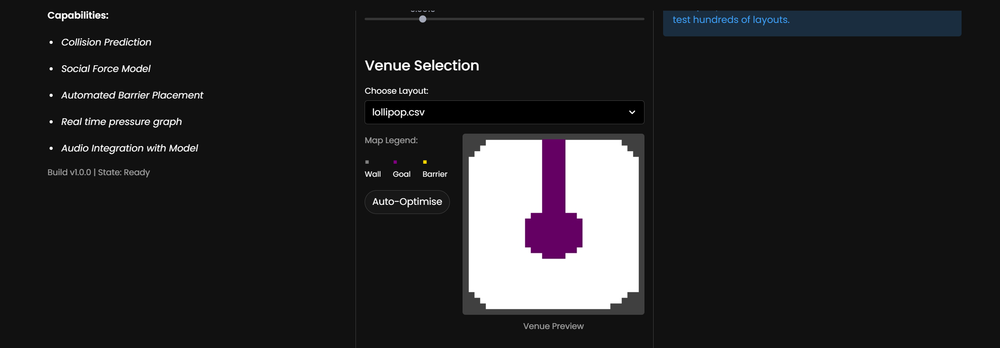
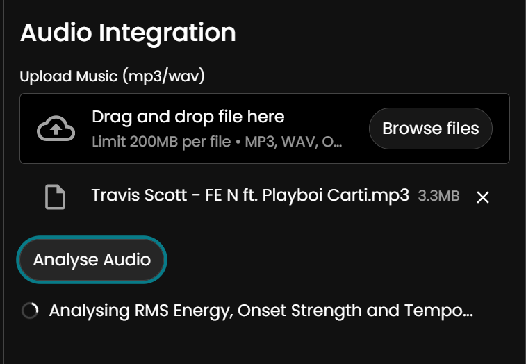
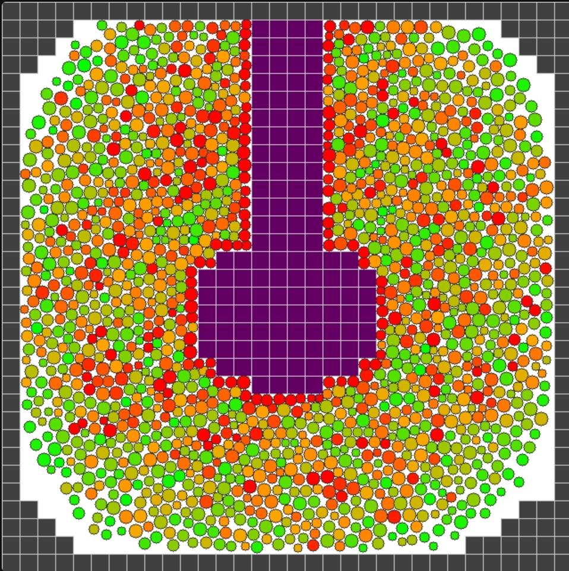
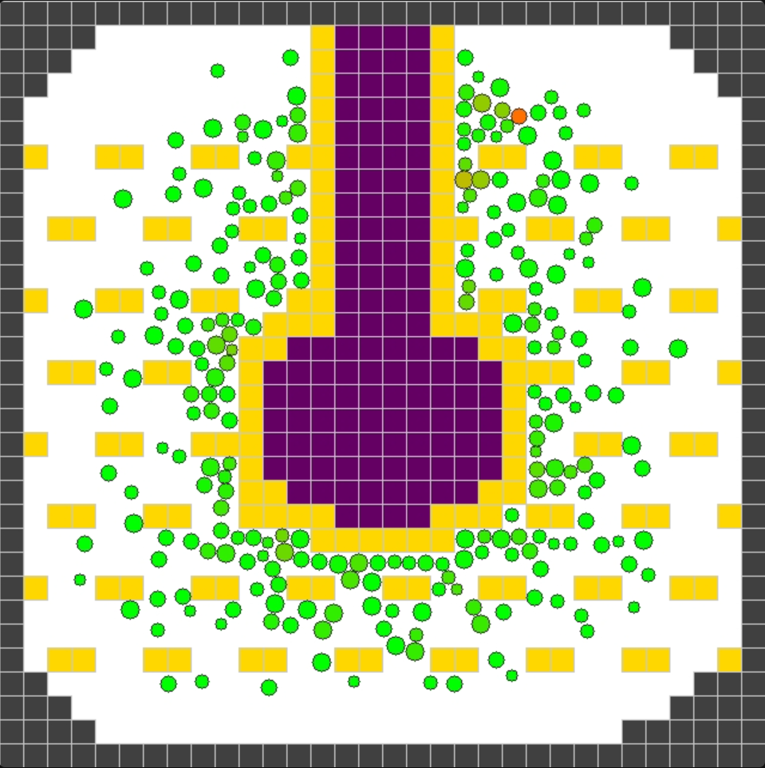
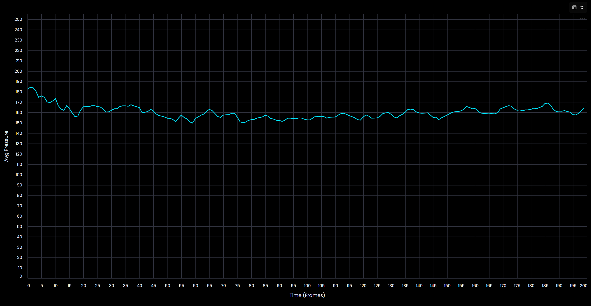

# Crowd Flow
### Protecting Communities Through Crowd Dynamics Simulation
> **Submission for AstonHack 11**

---

## The Problem

A community cannot thrive if it is not safe. Large gatherings are essential for human connection, but recent history has demonstrated how quickly these events can turn tragic due to inadequate planning.

The 2021 Astroworld Festival crush resulted in 10 deaths because initial plans lacked contingencies for crowd surges. Similarly, the 2022 Seoul Halloween tragedy claimed 159 lives, with authorities later admitting a lack of crowd control protocols. These were not inevitable accidents; they were failures of prediction. Crowd Flow was built to bridge this gap, offering organisers a computational safety engine to model high-attendance events and safeguard their communities.

---

## Technical Architecture

### High-Fidelity Physics Engine
We engineered a custom physics solver from scratch using Verlet Integration to accurately model the fluid-like dynamics of human bodies in high-density environments. Unlike standard game engines which approximate collisions, our Social Force Model calculates repulsion, friction, and desire forces for every individual agent.

To achieve real-time performance with over 2,000 autonomous agents, we utilised Numba to Just-In-Time (JIT) compile critical physics loops down to machine code. We also implemented Spatial Partitioning via Cell Lists, reducing collision detection complexity from O(N^2) to O(N).

### Audio-Reactive Crowd Behaviour
Crowds are not static entities; they react dynamically to their environment. Our system integrates real-time spectral audio analysis to modulate agent behaviour based on the music being played. By analysing RMS Energy, Onset Strength, and BPM, the simulation alters crowd rowdiness on the fly. This allows organisers to stress-test venue layouts against specific setlists, seeing exactly how a crowd might react to a bass drop or a high-tempo track.

### Monte Carlo Optimisation Engine
Identifying a dangerous choke point is only half the battle; fixing it is the real challenge. Organisers often rely on intuition to place barriers. Crowd Flow replaces intuition with mathematics.

We developed a Monte Carlo Search Engine that rapidly simulates hundreds of barrier configurations, testing strategies like funnels, wave-breakers, and islands. The system iteratively converges on a layout that mathematically minimises the average pressure exerted on the crowd, turning the complex problem of crowd safety into a solved equation.

---

## Visuals

<table>
  <tr>
    <td align="center">
       
      <b>Project Interface</b>
    </td>
    <td align="center">
       
      <b>Configuration Settings</b>
    </td>
  </tr>
  <tr>
    <td align="center">
       
      <b>Audio Analysis Engine</b>
    </td>
    <td align="center">
       
      <b>Uncontrolled Crowd</b>
    </td>
  </tr>
  <tr>
    <td align="center">
       
      <b>Optimised Crowd Flow</b>
    </td>
    <td align="center">
       
      <b>Pressure Heatmap</b>
    </td>
  </tr>
</table>

---

## Usage

### Quick Demo (Streamlit cloud)
The project is deployed using Streamlit Community Cloud (so it runs *very* slowly on those not so spec-ed servers) over [here](https://aston-hack-dmkqcjmivjitgdibmpmxxa.streamlit.app/)!

### Local Installation (Recommended)

To be able to experience the optimisations in full, install it locally.
* Clone the repo and `cd` into directory
* `pip install -r requirements.txt`
* `streamlit run app.py`
